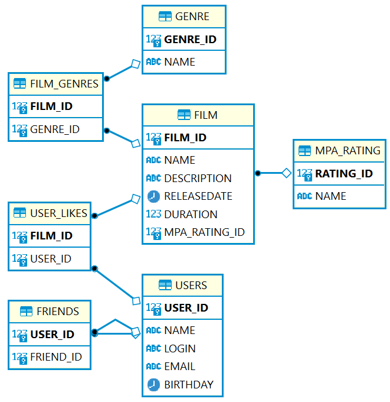

# java-filmorate
## Диаграмма для базы данных Filmorate

* __выбор 20 фильмов в алфавитном порядке в жанре психологический триллер:__
~~~~sql
SELECT *  
FROM film  
WHERE film_id IN (  
    SELECT film_id  
    FROM film_genres  
    WHERE genre_id IN (  
        SELECT genre_id  
        FROM genre  
        WHERE name = 'психологический триллер'  
    )  
)  
ORDER BY name  
LIMIT 20;  
~~~~
------------------------------------------------------------------------
* __выбор первых 10 фильмов с наибольшим кол-вом лайков:__
~~~~sql
SELECT f.name, f.description, f.releasedate, f.duration, rating.name  
FROM film AS f  
LEFT JOIN (  
        SELECT film_id,  
        COUNT(user_id) AS likes  
        FROM user_likes  
        GROUP BY film_id  
) AS top ON f.film_id = top.film_id  
LEFT JOIN (  
        SELECT *  
        FROM mpa_rating  
) AS rating ON f.mpa_rating_id = rating.rating_id  
ORDER BY likes DESC  
LIMIT 10;  
~~~~
-------------------------------------------------------------------------
* __список друзей пользователя с id = 5:__
~~~~sql
SELECT *  
FROM users  
WHERE user_id IN (  
        SELECT friend_id  
        FROM friends  
        WHERE user_id = 5  
);  
~~~~
------------------------------------------------------------------------
* __список друзей пользователя с id = 5 у которых др 14.03:__
~~~~sql
SELECT *  
FROM users  
WHERE user_id IN (  
        SELECT friend_id  
        FROM friends  
        WHERE user_id = 5  
)  
AND EXTRACT(MONTH FROM CAST(birthday AS date)) = '03'  
AND EXTRACT(DAY FROM CAST(birthday AS date)) = '14';  
~~~~
------------------------------------------------------------------------
* __список общих друзей пользователя с id = 1 и 12:__
~~~~sql
SELECT *  
FROM users  
WHERE user_id IN (  
        SELECT friend_id  
        FROM friends  
        WHERE user_id = 1  
        AND friend_id IN (  
                SELECT friend_id  
                FROM friends  
                WHERE user_id = 2  
        )  
);  
~~~~
